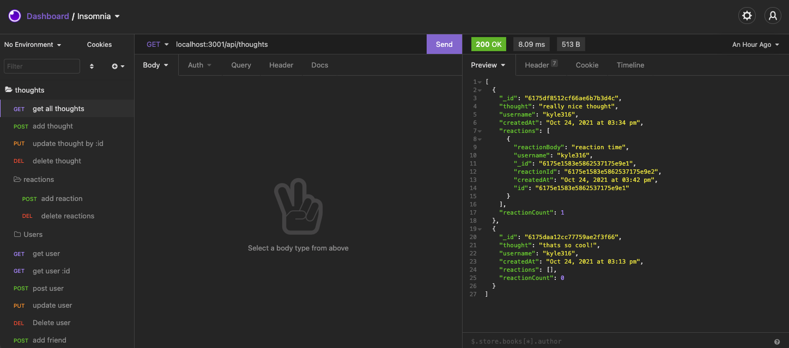

# The Social Net.

 ## Table of contents
* [Installation](#installation)
* [Usage](#usage)
* [Credits](#credits)
* [License](#license)

---
## Description

  this is an app showing off MongooseDB and how you can use it to store data for a social media project where you can store users, their friends, their thoughts, and reactions to their thoughts!

## Installation
  run npm install and then node server in the terminal and thats it!

## Usage
  [video 1](./assets/module-18-part1.mp4)
  
  [video 2](./assets/module-18-part2.mp4)
  

  ---

## Credits
  

  ### Have any questions or concerns? Contact me!
https://github.com/KyleKilmartin371/the_social_net

  ---
### License
  https://opensource.org/licenses/MIT

